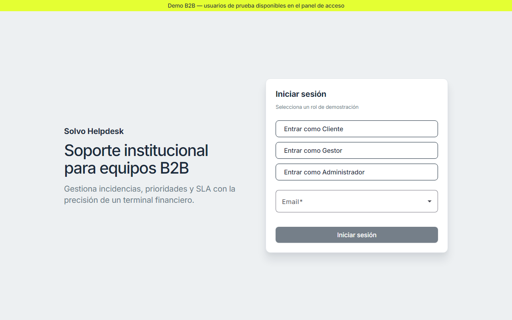
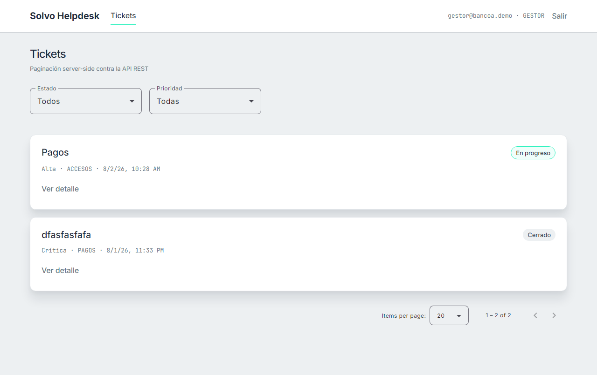
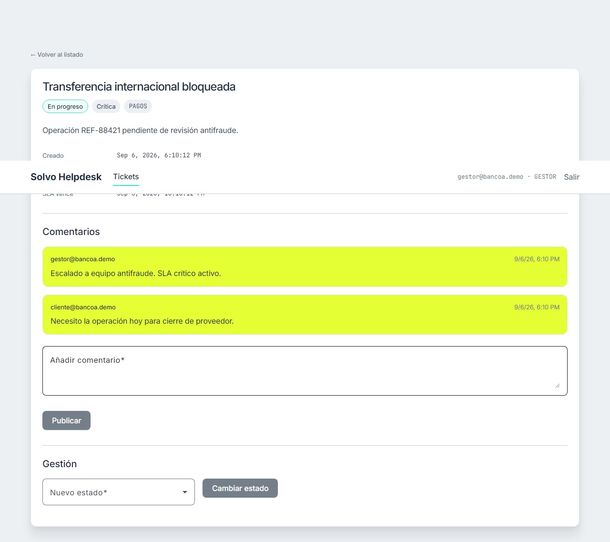
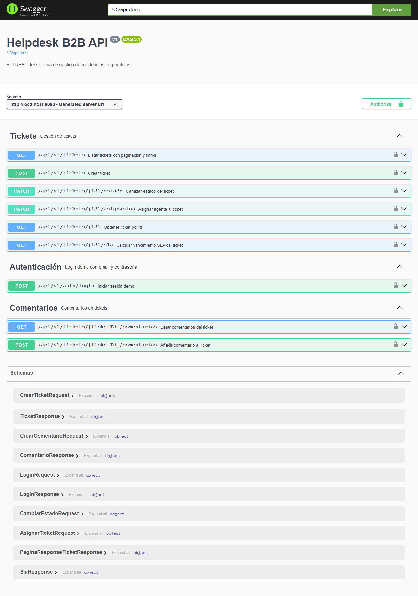

# Solvo-B2B Helpdesk

[](https://github.com/Admaal/Solvo-b2b/actions/workflows/ci.yml)

Sistema de gestión de incidencias corporativas — **Java 21 + Spring Boot + Angular 19**, arquitectura hexagonal, RBAC y despliegue consciente del coste.

> Portfolio piece for Spanish banking/consulting interviews: hexagonal Java, RBAC you can click, and a live demo that does not require GCP.  
> Documentación completa: [docs/PORTFOLIO.md](docs/PORTFOLIO.md)

## Demo

| Entorno | Cómo probar |
|---------|-------------|
| Local | Ver [Demo rápida](#demo-rápida-local) |
| Pública | [https://frontend-rouge-rho-30.vercel.app](https://frontend-rouge-rho-30.vercel.app) — API [helpdesk-api-vq5a.onrender.com](https://helpdesk-api-vq5a.onrender.com/actuator/health) |

Usuarios demo: `cliente@bancoa.demo`, `gestor@bancoa.demo`, `admin@bancoa.demo` (contraseña `demo`). Repositorio: [github.com/Admaal/Solvo-b2b](https://github.com/Admaal/Solvo-b2b).

### Capturas

| Login demo | Listado tickets | Detalle + comentarios | Swagger |
|------------|-----------------|----------------------|---------|
|  |  |  |  |

> Generar capturas: `.\scripts\capture-screenshots.ps1` (app en `:4200` y `:8080`).  
> Swagger UI solo está activo fuera del perfil `prod` (local).

## Demo rápida (local)

```powershell
docker compose up -d
cd backend && .\mvnw.cmd spring-boot:run    # :8080 (perfil `local`, ddl-auto=update)
cd frontend && npm start                     # :4200 (proxy `/api` → backend)
```

| Rol | Email | Contraseña |
|-----|-------|------------|
| Cliente | `cliente@bancoa.demo` | `demo` |
| Gestor | `gestor@bancoa.demo` | `demo` |
| Admin | `admin@bancoa.demo` | `demo` |

Los botones «Entrar como…» envían email + contraseña en un clic. Auth de demo, no bancaria: evita el bypass total por email.

Al primer arranque con BD vacía se siembran **9 tickets** en todos los estados + comentarios demo.

**Ver seed nuevo:** `.\scripts\reset-local-db.ps1` y reiniciar backend.

El JWT se guarda en `localStorage` (decisión de SPA demo; no es cookie HttpOnly).

## Qué demuestra

- Arquitectura hexagonal con dominio Java puro (sin Spring en `domain/`)
- Máquina de estados en dominio — transiciones inválidas rechazadas en backend
- Aislamiento multi-tenant: el gestor de la org A no muta tickets de la org B
- RBAC navegable (cliente vs gestor vs admin)
- Comentarios en tickets (hilo cliente/gestor)
- Grid Angular con paginación server-side real
- JWT + interceptores + guards
- Tests: ArchUnit, PIT ≥75% (también en CI), Testcontainers, Jasmine
- Imagen Docker Alpine JRE + layered build cache en CI (~210 MB)
- Helm chart K8s (kind bajo demanda) + CI GitHub Actions + Render + Vercel + Supabase

## Stack

`Java 21` · `Spring Boot 3.4` · `PostgreSQL` · `Angular 19` · `Material` · `Docker` · `Helm` · `GitHub Actions` · `Render` · `Vercel` · `Supabase`

## Estructura

```
backend/          # API REST hexagonal
frontend/         # Angular standalone + Signals (Vercel)
deploy/helm/      # Chart Kubernetes (kind bajo demanda)
render.yaml       # Blueprint de la API en Render
.github/          # CI + keep-alive de la demo
docs/             # Portfolio, setup GitHub, screenshots
scripts/          # reset BD, capturas, checklist de go-live
```

## Comandos

```powershell
.\backend\mvnw.cmd test              # unitarios + ArchUnit
.\backend\mvnw.cmd verify            # + Testcontainers
.\backend\mvnw.cmd pitest:mutationCoverage
cd frontend && npm test -- --watch=false --browsers=ChromeHeadless
cd frontend && npm run build
docker build -t helpdesk-backend:local backend
.\scripts\helm-lint.ps1
.\scripts\reset-local-db.ps1         # wipe Postgres local + seed fresco
.\scripts\deploy-demo.ps1            # imprime el orden de go-live
```

## Despliegue

| Componente | Plataforma |
|------------|------------|
| API (demo) | Render (Docker, health `/actuator/health`, keep-alive cada 5 min) |
| Frontend | Vercel (SPA; `apiUrl` absoluto a Render) |
| BD prod | Supabase (Session pooler, puerto 5432) |
| K8s (portfolio) | Helm + kind (sin clúster 24/7) |

Orden: tablas en Supabase → Render → Vercel con `NG_APP_API_URL`.  
**Configurar repo y nubes:** [docs/SETUP-GITHUB.md](docs/SETUP-GITHUB.md)

## Licencia

[MIT](LICENSE) — proyecto de portfolio.
